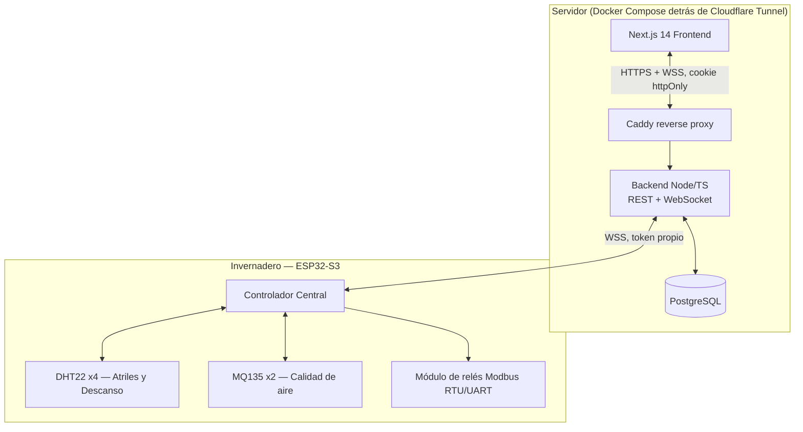

# 🍄 Shiitake-Lindo V2

Plataforma SCADA/IoT para el control automatizado de un invernadero de Shiitake (*Lentinula edodes*). Reemplazo completo, reescrito desde cero, del sistema anterior — firmware, backend y frontend nuevos, misma apariencia para el operador.

El sistema gestiona dos zonas del cultivo de forma independiente:
1. **Atriles** — fructificación, control estricto de humedad alta.
2. **Descanso** — recuperación/expansión de micelio, control térmico e higrométrico.

---

## Estado actual

🟢 **Producción** en [`shiitake.ger-cloud.cc`](https://shiitake.ger-cloud.cc). Promovido tras la marcha blanca en `prueba.ger-cloud.cc`.

---

## Arquitectura



- **Auth**: 100% local, sin ningún proveedor externo — contraseñas con bcrypt, sesión firmada con JWT propio en una cookie httpOnly (`Backend/src/auth/local.ts`). El backend resuelve el rol (`admin` / `operador` / `lectura`) contra Postgres en cada request. Solo un admin puede crear usuarios nuevos.
- **Tiempo real**: un único WebSocket (`/ws`) — canal navegador (misma cookie de sesión) y canal dispositivo (token propio del ESP32, independiente).
- **Comandos manuales**: confirmados por ACK real del dispositivo en máx. 5s — nunca se asume éxito sin confirmación.
- **Firmware**: control 100% local y autónomo si se pierde Internet; solo el servidor gana al reconectar (sin comparar versiones). Redundancia dual de sensores por zona.
- **OTA**: firmada (SHA-256 + Ed25519) — el ESP32 rechaza cualquier binario no firmado por el servidor.
- **Despliegue**: Docker Compose (`infra/docker-compose.yml`) — Postgres, Backend, Frontend, Caddy y `cloudflared` en el mismo stack, sin puertos expuestos a internet salvo por el túnel.

## Estructura del repositorio

```text
Shiitake-Lindo-V2/
├── Firmware/GreenhouseController/   # Firmware ESP32-S3 (Arduino/C++, ver su propio README)
├── Backend/                         # API REST + WebSocket + Postgres (Node/TypeScript)
├── Frontend/                        # Next.js 14 (panel SCADA)
├── Shared/                          # Tipos TypeScript compartidos Backend/Frontend
├── infra/                           # docker-compose, Caddyfile, migraciones SQL
└── docs/
    ├── PLAN_MIGRACION.md            # Plan completo de migración (contexto y decisiones)
    └── RUNBOOK_INFRA.md             # Guía paso a paso de despliegue en el servidor
```

## Desarrollo local

```bash
cd Backend && npm install && npm run dev    # http://localhost:3001
cd Frontend && npm install && npm run dev   # http://localhost:3000
```

## Despliegue en el servidor

Ver `docs/RUNBOOK_INFRA.md` para la guía completa (VM, Docker, Cloudflare Tunnel, claves OTA). Resumen:

```bash
git clone https://github.com/GerAjeno/Shiitake-Lindo-V2.git && cd Shiitake-Lindo-V2
cp infra/.env.example infra/.env   # completar secretos
docker compose -f infra/docker-compose.yml --env-file infra/.env up -d --build
```

## Firmware

Ver `Firmware/GreenhouseController/README.md` para librerías, configuración de placa (ESP32-S3 N16R8, PSRAM OPI, partition scheme custom) y qué completar en `Config.h` antes de compilar.

## Seguridad

- Ninguna credencial real (WiFi, tokens, contraseñas) se commitea al repo — `Config.h` del firmware se mantiene local con `git update-index --skip-worktree` una vez completado con valores reales.
- El endpoint de subida de firmware exige rol `admin` autenticado; el binario se firma en el servidor antes de notificar al dispositivo.
- Auditoría inmutable de toda acción manual (usuario, IP, fecha, valor anterior/nuevo) en `sistema_logs` — sin endpoint de borrado, ni para administradores.

---

<div align="center">
  <p><b>Desarrollado por German Marambio © 2026</b></p>
</div>
